# Game Of Thrones Data Visualization using T-SNE

* Given data about the battles, character-deaths and character-predictions from the Game Of Thrones series, analyze the data and visualize it in a way that a classifier would.
* Essentially draw out various kinds of boundaries that would fit the data well and allow predictions with minimal error rates.
* Performed T-SNE dimensionality reduction to 2 dimensions so it could be visualized on a plane. Using 3 dimensions would allow for better visualizations but training models to fit that data might not be the best at times.

## Data Visualization Challenge
Game of Thrones data visualization using T-SNE challenge by @Sirajology on [Youtube](https://www.youtube.com/watch?v=yQsOFWqpjkE)

## Dependencies
* numpy
* pandas
* scikit-learn

## Usage
Run `python main.py` and it would perform visualizations on all the three data files given and show plots with data projected onto 2 dimensions using T-SNE.

## Results

Raw Data             	|  Analyzed Data
:-------------------------:|:-------------------------:
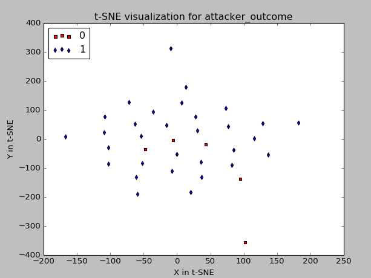 	| 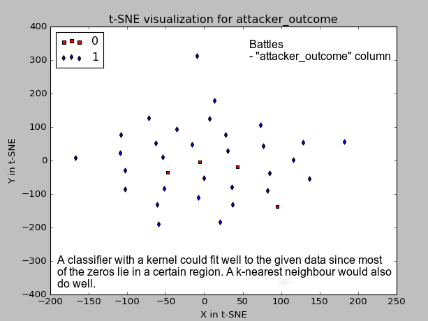
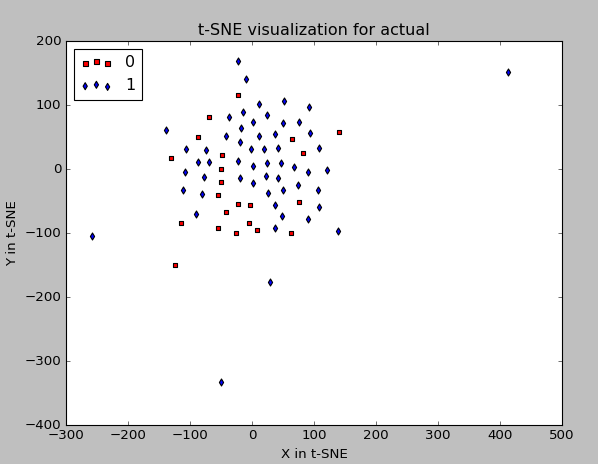 	| 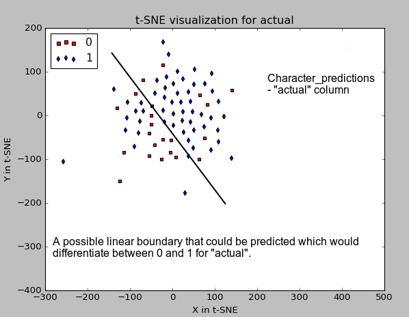
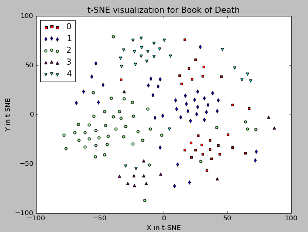 	| 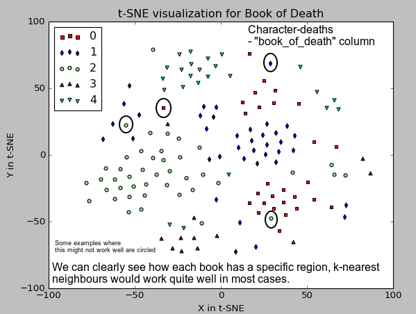
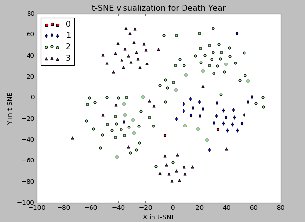 	| 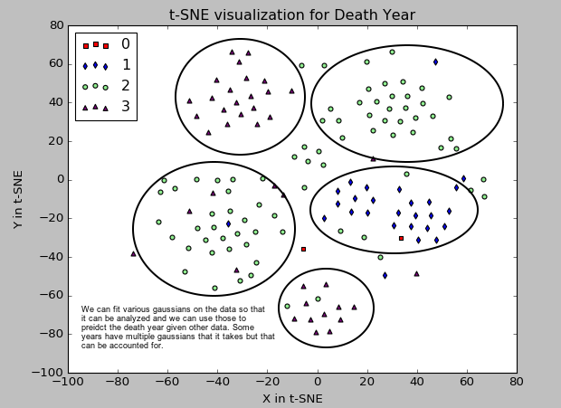
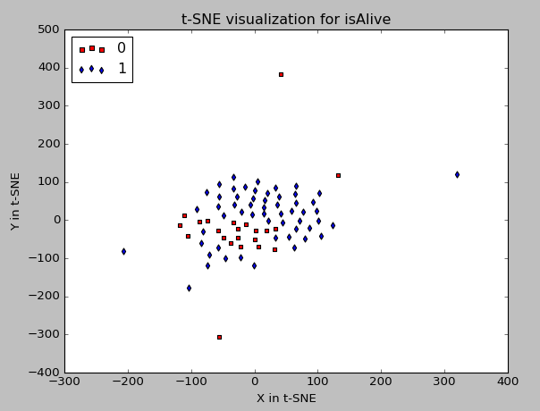 	| 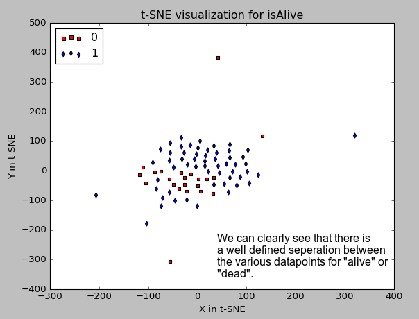
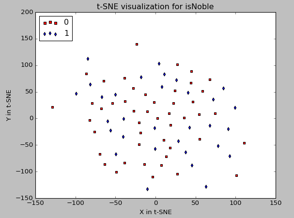 	| 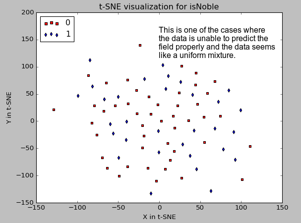
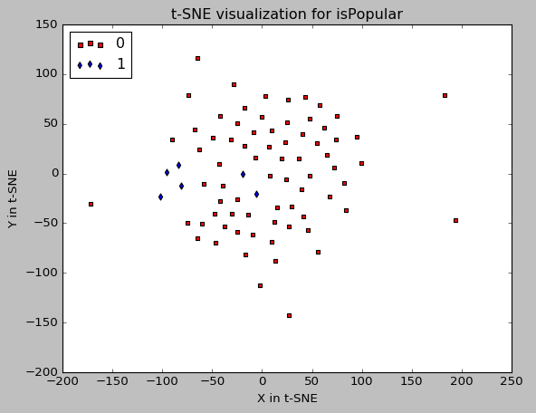 	| 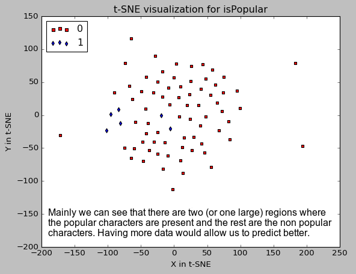
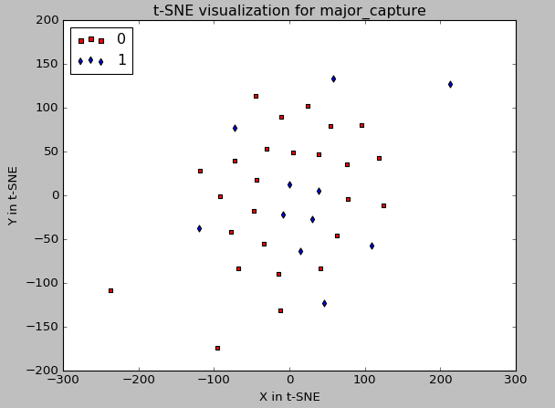 	| 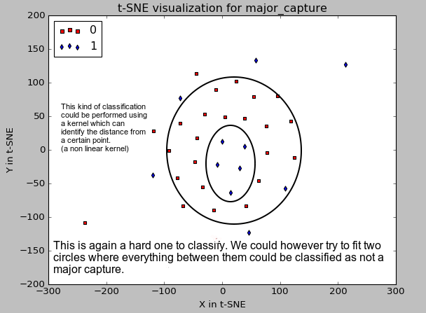
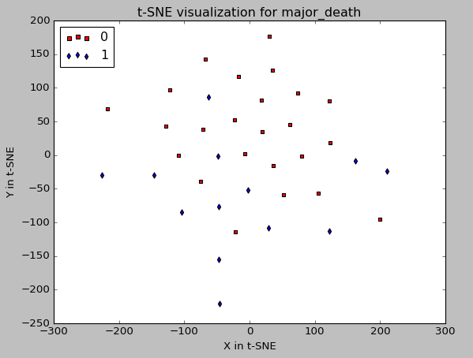 	| 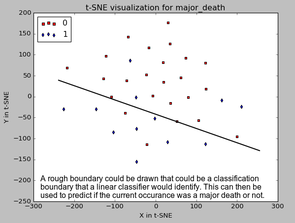

The Visualizations folder has the raw data collected (images) in "DataCollected" as well as some analysis that was done on them in "AnalyzedData"

## Learning Outcomes

* Not all data can be reduced and visualized well in 2 dimensions, some may require more and its hard to select the correct amount of dimensions we want to reduce our data to get the best results.
* There are always outliers that don't fit well with the predictions, but the percentage is generally quite small.
* Some data can be split well with just linear classifiers whereas some require more advanced types of classification and fitting a linear boundary in this 2 dimensional space might not be enough.
* Using kernels which map these two dimensions into higher ones and then fitting classifiers would do well at times.
* Apart from T-SNE, PCA (Principle Component Analysis) and LDA (Linear Discriminant Analysis) are some other alternatives to perform dimensionality reduction. They work in a similar to T-SNE where they compute a matrix of weights (mainly using eigen vector decompositions in various forms) which get multiplied with the data (in a matrix dot product form) to get the final reduced dimensional form of the data.